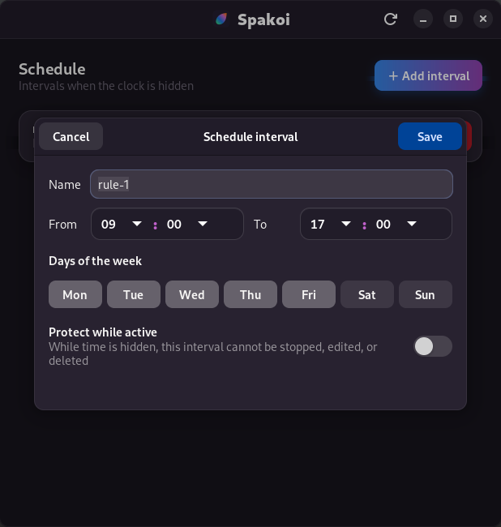
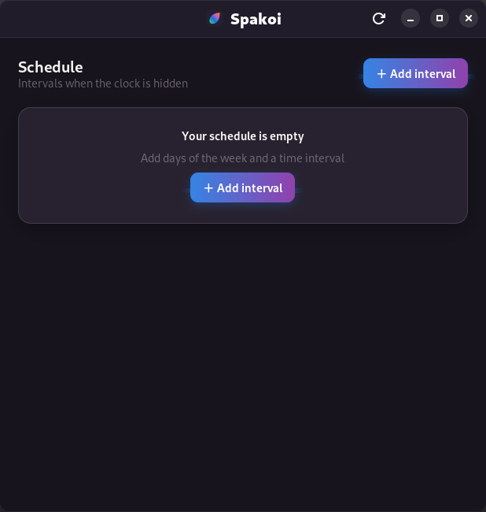

# Spakoi

<p align="center">
  
</p>

<p align="center">
  <a href="https://github.com/VictoriaAppDeveloper/spakoi/actions/workflows/ci.yml"></a>
  <a href="LICENSE"></a>
  
</p>

> Hide the clock. Keep the computer. Lose the pressure of time.

Spakoi hides wall-clock time from GNOME Shell so you can keep using your
computer without constantly measuring the moment. It hides the clock in the
top panel, Date Menu, lock screen, and GDM while leaving the system clock
untouched. Applications continue to receive the correct time.

The project currently supports GNOME Shell 43, 49, and 50 and includes:

- a system-wide GNOME Shell extension for user, lock-screen, and GDM sessions;
- a background daemon with schedule evaluation and a D-Bus API;
- weekly, overlapping, and overnight intervals;
- a GTK interface with validated time pickers and per-interval Play/Stop;
- optional protected intervals that cannot be changed while time is hidden;
- a command-line interface for status, schedules, overrides, and diagnostics;
- normal and strict policies with safe UI restoration when the extension stops.

## Install

Spakoi requires Python 3.11+, PyGObject (`python3-gi`), and GNOME Shell 43, 49,
or 50. Installation does not require pip. The Makefile selects the appropriate
extension entry point for the installed GNOME version.

When upgrading from TimeVeil, stop its old service first:

```sh
systemctl --user disable --now timeveil.service 2>/dev/null || true
sudo make install
systemctl --user daemon-reload
systemctl --user enable --now spakoi.service
```

Restart GNOME Shell so it discovers the new extension ID. On X11, press
Alt+F2, enter `r`, and press Enter. On Wayland, log out and back in. Then run:

```sh
gnome-extensions enable spakoi@victoriaappdeveloper.github.io
```

The installer copies an existing `/etc/timeveil/config.toml` to
`/etc/spakoi/config.toml` if the new configuration does not exist. User config
and state files are also read from their old TimeVeil locations as a migration
fallback.

## Graphical interface

Open **Spakoi** from the applications menu or run:

```sh
spakoi-gui
```

<p align="center">
  
</p>

<table>
  <tr>
    <td width="50%"></td>
    <td width="50%"></td>
  </tr>
  <tr>
    <td align="center">Interval editor</td>
    <td align="center">Empty schedule</td>
  </tr>
</table>

Create an interval by choosing its days and start/end times, then use Play or
Stop to enable or pause it without deleting it. The protection switch prevents
an active interval from being edited or stopped until its hidden-time period
ends. The warning is permanent by design once protection becomes active.

Closing the window does not stop Spakoi. Its daemon continues in the background,
and the leaf icon in the top panel opens the application.

## Command line

```sh
spakoi status
spakoi schedule add --id work --days mon-fri --from 09:00 --to 17:00
spakoi schedule add --id night --days sat,sun --from 22:00 --to 07:00
spakoi schedule list
spakoi schedule remove work
```

Manual overrides and diagnostics are also available:

```sh
spakoi hide
spakoi hide --for 30m
spakoi hide --until 18:00
spakoi show
spakoi show --for 10m
spakoi enable
spakoi disable
spakoi config validate
spakoi doctor
```

## Configuration

The user configuration is stored at
`$XDG_CONFIG_HOME/spakoi/config.toml`, normally
`~/.config/spakoi/config.toml`. A system configuration at
`/etc/spakoi/config.toml` takes precedence. Runtime overrides are stored at
`$XDG_STATE_HOME/spakoi/state.json`, so timed overrides survive daemon and
system restarts.

For a protected system-wide schedule, set `mode = "strict"` and use owner
`root:root`, mode `0644` for the file, and `0755` for `/etc/spakoi`. Strict
mode is not a security boundary against a user with root access.

GDM requires the extension to be installed system-wide (which `make install`
does) and enabled in the `gdm` user's dconf profile. The exact dconf deployment
method depends on the distribution. Restart GDM or the system after changing it.

## Development and verification

Run directly from the source tree:

```sh
python3 -m spakoi.daemon
python3 -m spakoi.cli status
```

Run the automated checks:

```sh
make test
spakoi config validate
spakoi doctor
journalctl --user -u spakoi.service
```

The test suite covers regular, overnight, and overlapping intervals, DST, and
override precedence. Lock-screen and GDM integration must also be checked on a
real GNOME session.

Spakoi intentionally does not hide time shown by browsers, terminals, or other
applications, and it does not block commands such as `date` or `timedatectl`.

## Community

Bug reports and feature requests are welcome in
[GitHub Issues](https://github.com/VictoriaAppDeveloper/spakoi/issues). Please
read [CONTRIBUTING.md](CONTRIBUTING.md) before submitting a pull request and
[SECURITY.md](SECURITY.md) before reporting a vulnerability.

Maintainers should follow [RELEASING.md](RELEASING.md) when publishing a signed
release.

Spakoi is available under the [GPL-3.0-or-later license](LICENSE).
